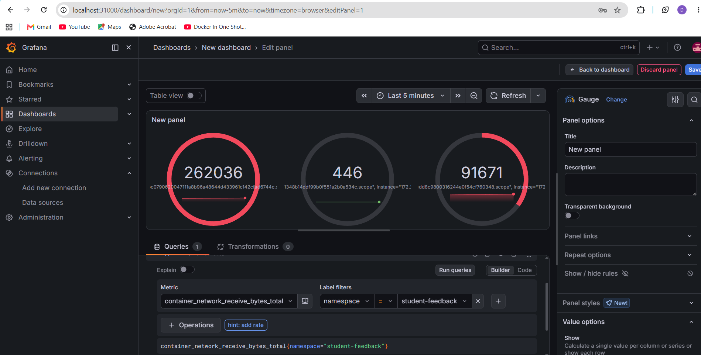
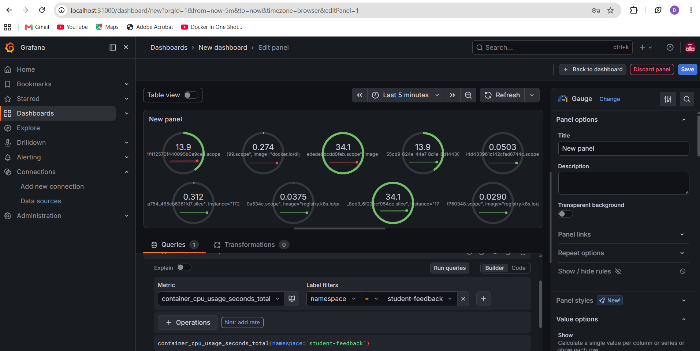
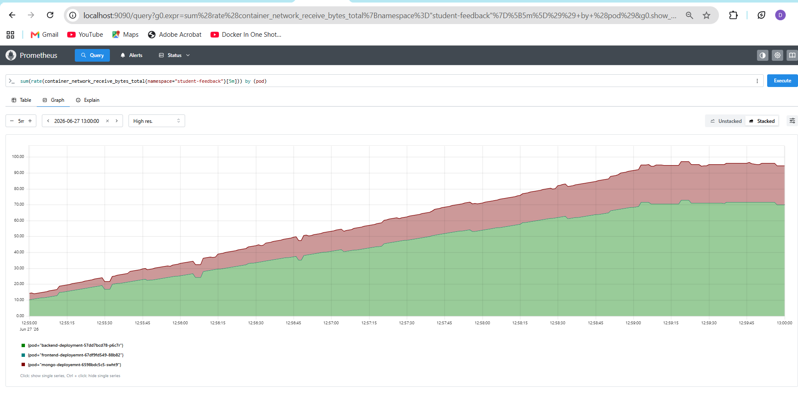
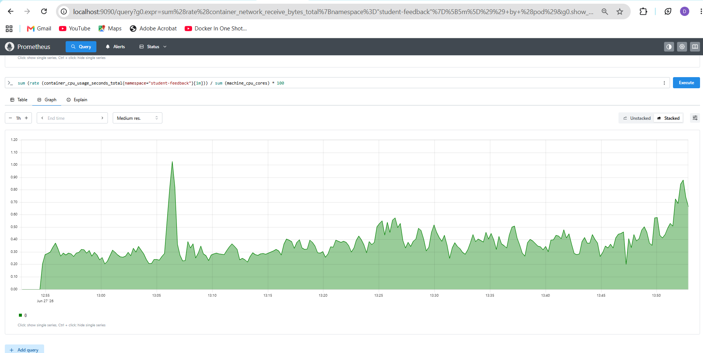

📌 Project Title

Student Feedback App – Kubernetes Deployment with Monitoring

📌 Tech Stack
Kubernetes (Kind )
Docker
Helm
Prometheus
Grafana
CI/CD ( GitHub Actions )

📌 Features
Microservices architecture (Frontend, Backend, MongoDB)
Kubernetes deployment using YAML files
Service communication using ClusterIP & NodePort
Monitoring using Prometheus + Grafana
Real-time metrics (CPU, Memory, Network)
AWS-based deployment (if used)

📌 How to Run
git clone <repo-url>
cd student-feedback/k8s
kubectl apply -f .

📌 Monitoring Setup
helm install monitoring prometheus-community/kube-prometheus-stack -n monitoring

📌 Screenshots

Grafana dashboards
NETWORK

 

CPU

  

 Promethus dashboards

🚀 3. GitHub push commands
git init
git add .
git commit -m "Initial commit - Kubernetes + Monitoring project"
git branch -M main
git remote add origin https://github.com/<username>/student-feedback.git
git push -u origin main
